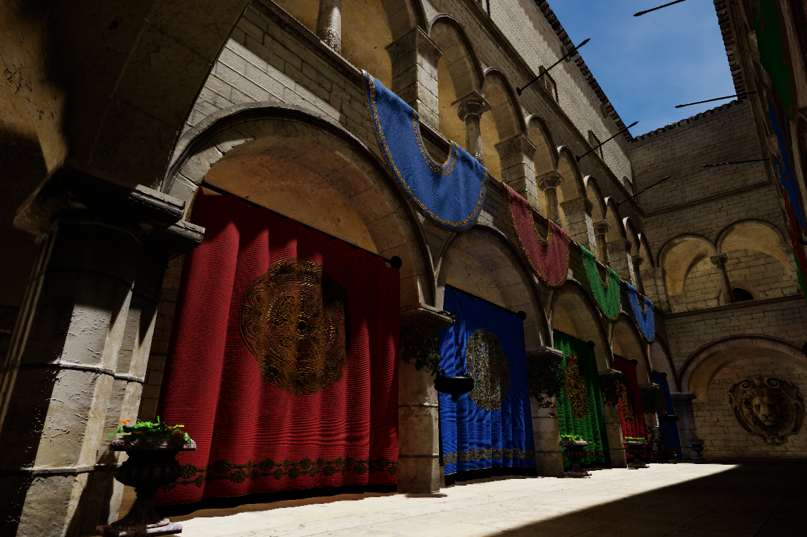

# Flare
A real-time hybrid rendering sample featuring GPU culling, deferred shading, PBR, TAA, ray-traced shadow, and DDGI

## Examples

## Features
- GPU-driven rendering
  - Frustum culling
  - Occlusion culling
  - Indirect draw
- Deferred shading
- Physically based rendering
- Image-based lighting
- Dynamic diffuse global illumination
- Screen space reflections
- Ray-traced soft shadow
- Ground-truth ambient occlusion
- Temporal anti-aliasing
- ACES filmic tone mapping
- Real-time UI
- GPU profiler

## Usage
* `W`/`A`/`S`/`D` - camera movement
* `LMB` - hold to look around
* `F1` - toggle UI
