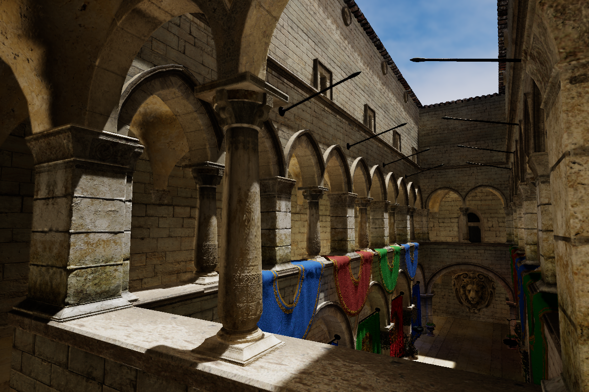
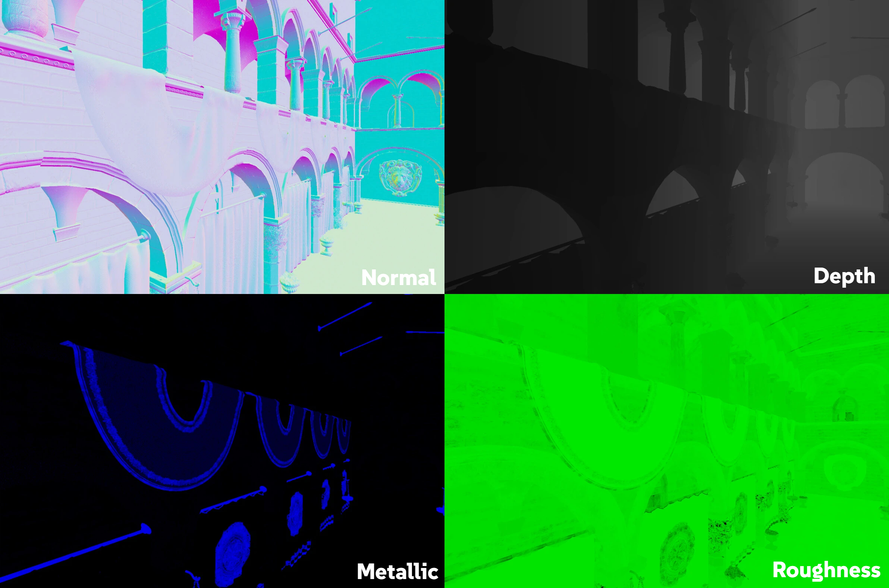
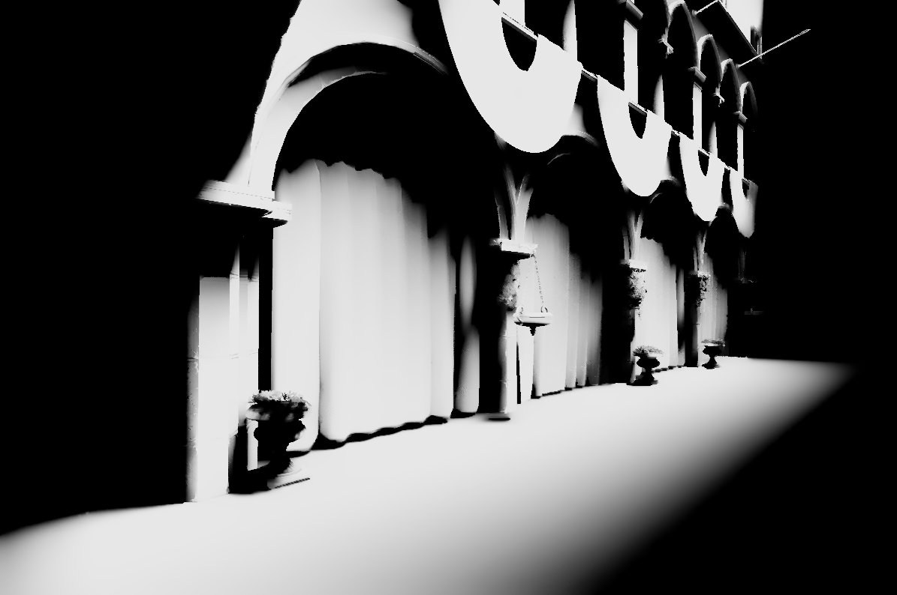
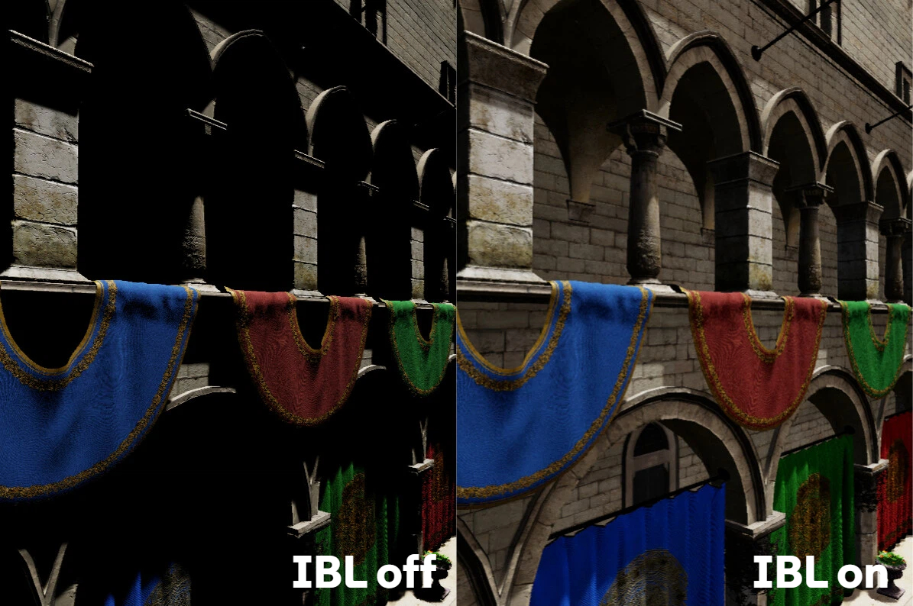
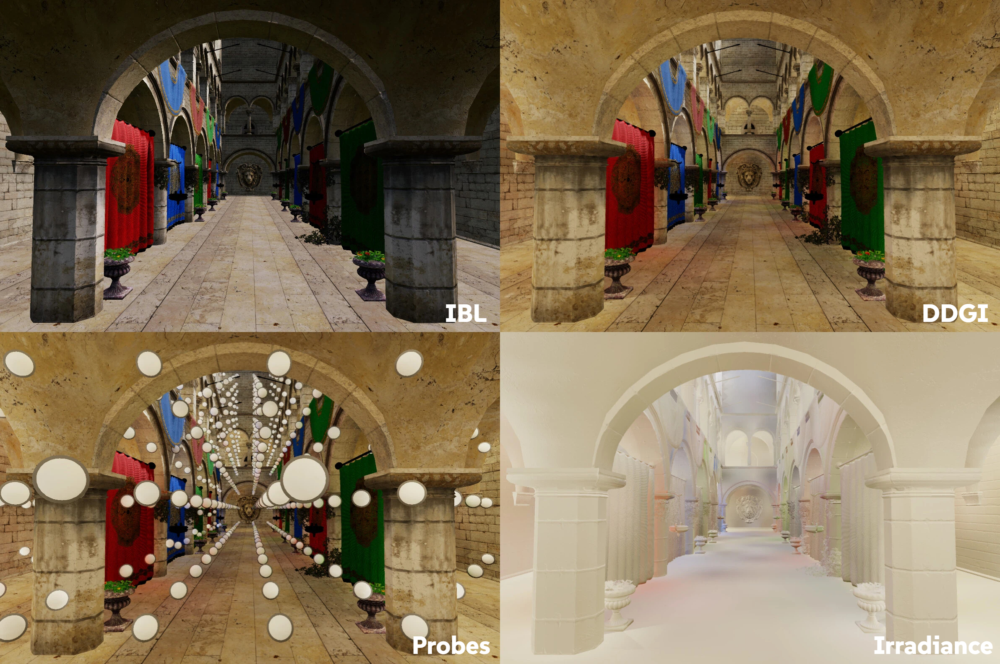
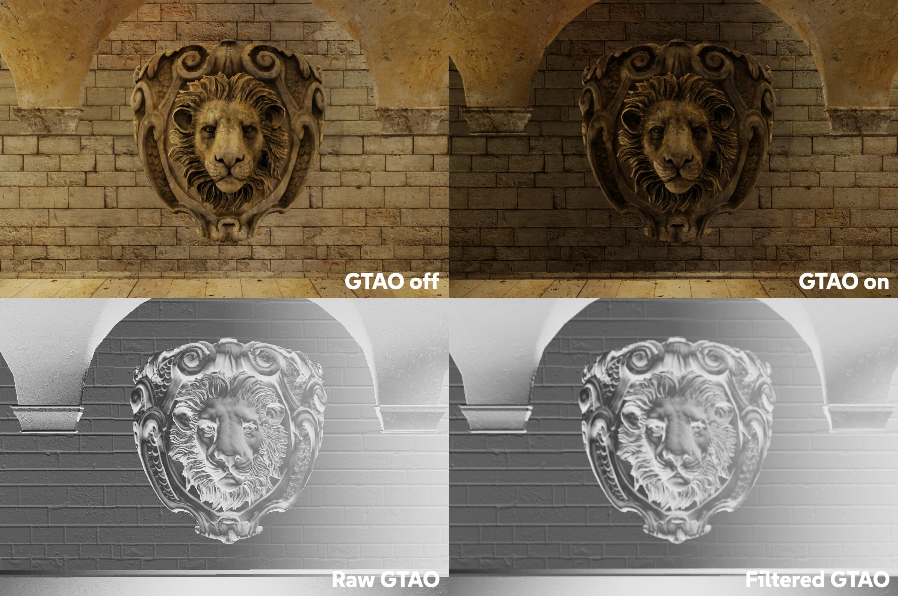
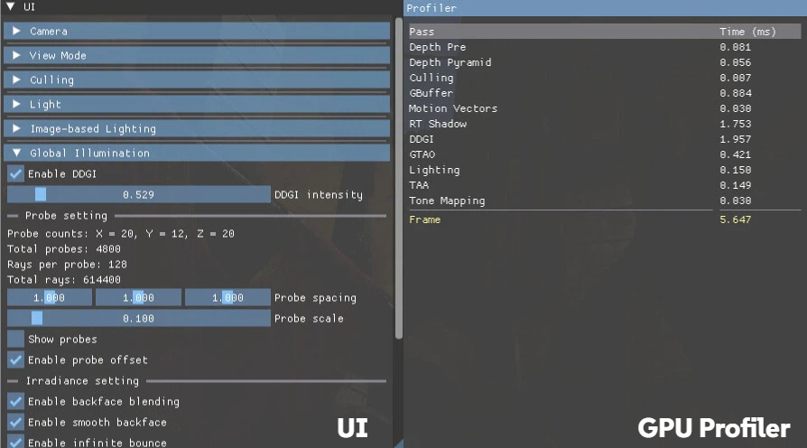

# Flare
A real-time hybrid renderer featuring GPU culling, deferred shading, PBR, DDGI, GTAO, soft shadow with SVGF, and TAA

## Examples



## Features
- GPU-driven rendering
  - Frustum culling
  - Occlusion culling
  - Indirect draw
- Physically based rendering
- Deferred shading
  
- Ray-traced soft shadow
  
- Spatiotemporal variance-guided filtering
  
- Image-based lighting
  
- Dynamic diffuse global illumination
  
- Ground-truth ambient occlusion
  
- Temporal anti-aliasing
- ACES tone mapping
- Real-time UI
- GPU profiler
  


## To do
- Asynchronous loading
- Multi-threaded command recording
- Visibility buffer
- Mesh shader
- Clustered rendering
- Screen space reflections

## Prerequisites
* Windows 11
* [Visual Studio 2022](https://visualstudio.microsoft.com/zh-hant/downloads/) or newer
* [Vulkan SDK 1.4](https://vulkan.lunarg.com/) or newer
* [CMake 3.3](https://cmake.org/) or newer


## Building
### Windows 
```
git clone --recursive https://github.com/lanwenzhang/Flare.git
cd Flare
mkdir build
cd build
cmake -G "Visual Studio 17 2022" ..
```

## Usage
* `W`/`A`/`S`/`D` - camera movement
* `LMB` - hold to look around
* `F1` - toggle UI
* `F2` - toggle GPU profiler

## Reference
### Third-party library
* [assimp](https://github.com/assimp/assimp)
* [glfw](https://github.com/glfw/glfw)
* [glm](https://github.com/g-truc/glm)
* [imgui](https://github.com/ocornut/imgui)
* [ktx](https://github.com/KhronosGroup/KTX-Software)
* [nlohmann](https://github.com/nlohmann/json)
* [stb](https://github.com/nothings/stb)

### Open source code
* [Falcor](https://github.com/NVIDIAGameWorks/Falcor)
* [hybrid-rendering](https://github.com/diharaw/hybrid-rendering)
* [Mastering Graphics Programming with Vulkan](https://github.com/PacktPublishing/Mastering-Graphics-Programming-with-Vulkan)
* [RTXDI](https://github.com/NVIDIA-RTX/RTXDI)
* [XeGTAO](https://github.com/GameTechDev/XeGTAO)
* [3D-Graphics-Rendering-Cookbook-Second-Edition](https://github.com/PacktPublishing/3D-Graphics-Rendering-Cookbook-Second-Edition)
* [Piccolo](https://github.com/BoomingTech/Piccolo)

### Research paper
* [2D Polyhedral Bounds of a Clipped, Perspective-Projected 3D Sphere](https://jcgt.org/published/0002/02/05/)
* [Spatiotemporal Variance-Guided Filtering: Real-Time Reconstruction for Path-Traced Global Illumination](https://research.nvidia.com/publication/2017-07_spatiotemporal-variance-guided-filtering-real-time-reconstruction-path-traced)
* [Dynamic Diffuse Global Illumination with Ray-Traced Irradiance Fields](https://jcgt.org/published/0008/02/01/)
* [Scaling Probe-Based Real-Time Dynamic Global Illumination for Production](https://jcgt.org/published/0010/02/01/)
* [Practical Real-Time Strategies for Accurate Indirect Occlusion](https://research.activision.com/publications/archives/atvi-tr-16-01practical-realtime-strategies-for-accurate-indirect-occlusion)
* [A Low-Discrepancy Sampler that Distributes Monte Carlo Errors as a Blue Noise in Screen Space](https://belcour.github.io/blog/slides/2019-sampling-bluenoise/index.html)
* [Using Blue Noise For Raytraced Soft Shadows](https://blog.demofox.org/2020/05/16/using-blue-noise-for-raytraced-soft-shadows)
* [Temporal Reprojection Anti-Aliasing in INSIDE](https://www.gdcvault.com/play/1023254/Temporal-Reprojection-Anti-Aliasing-in)

### Assets
* [Sponza](https://github.com/KhronosGroup/glTF-Sample-Assets/blob/main/Models/Sponza/README.md)

